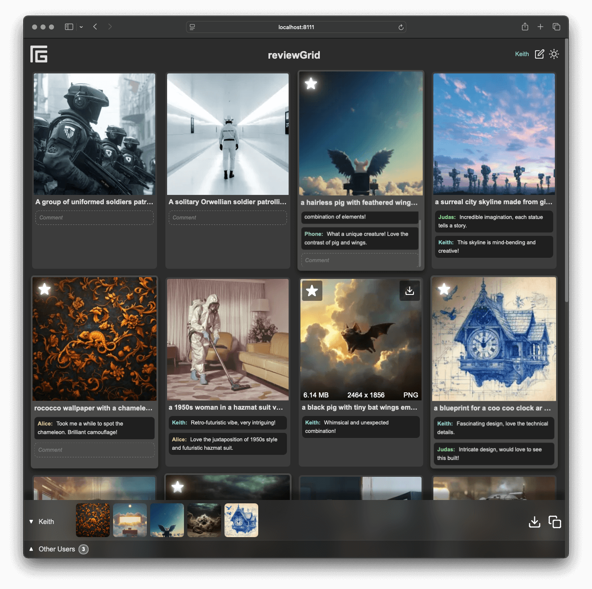
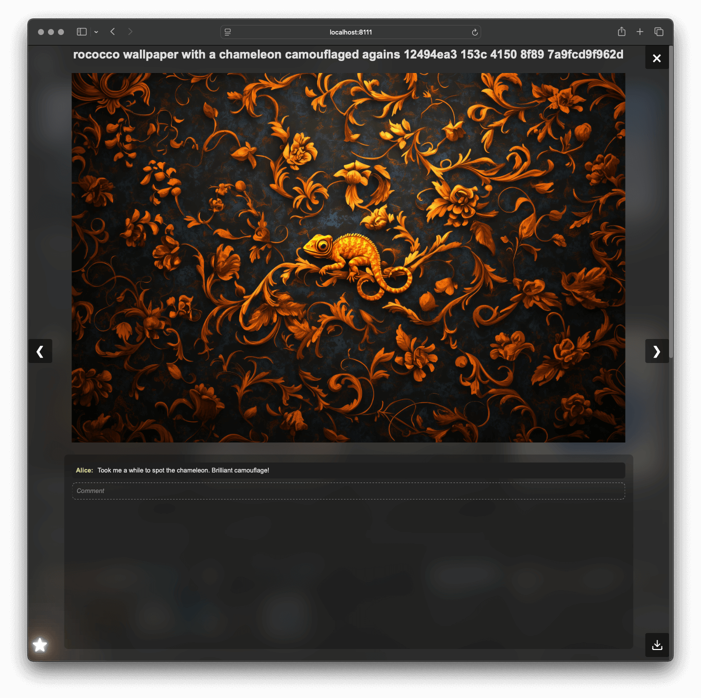

# ReviewGrid

ReviewGrid is a lightweight, single-file PHP application designed for quick and easy image gallery creation. It's built to be ephemeral and portable, allowing users to instantly create an interactive gallery from any folder of images.


## Screenshots

### Main Interface


### Modal View


This screenshot showcases the main interface of ReviewGrid, displaying the image gallery with commenting and starring functionality.


## Features

- **Minimal setup**: Just place the PHP file in any directory with images
- **Self-contained**: All generated data is stored within a `_data` folder for easy management
- **Instant gallery creation**: Automatically generates a gallery from images in the directory
- **Multiple image format support**: Handles jpg, jpeg, png, gif, and webp formats
- **JSON-based data storage**: Uses a simple JSON file as a lightweight database
- **User identification by IP**: Allows for persistent user actions without login (but naturally comes with obvious caveats)
  - Each unique IP address is treated as a separate user
  - Users can set and edit their display names
  - User names are color-coded for easy identification
- **Interactive features**:
  - Commenting: Add, edit, and view comments on images
  - Starring: Mark favorite images, which are highlighted in the gallery and displayed in a footer
  - Real-time updates: Changes made by any user are instantly reflected for all other users without page refresh
- **Modal view**: Full-size image viewing with navigation and comment display
- **Responsive design**: Adapts to various screen sizes for optimal viewing
- **Footer with starred images**: Quick access to favorited images for all users
- **Download options**: 
  - Download individual images
  - "Download All" button for starred images
- **Copy functionality**: Copy image URLs and comments to clipboard
- **Sorting and filtering**: 
  - Comments sorted by timestamp
  - Invalid or non-existent images filtered out
- **Performance optimizations**:
  - WebP format used for thumbnails
  - Full-size images loaded only when viewed in modal
- **Accessibility features**: Aria labels and titles for better screen reader support
- **Basic security measures**: User input escaping implemented
- **Custom styling**: 
  - Dark theme with customizable CSS variables
- **Easy cleanup**: Remove the PHP file and `_data` folder to revert to the original image directory

ReviewGrid is perfect for quickly sharing and reviewing sets of images, whether for personal use, client presentations, or collaborative projects. Its self-contained nature means you can easily move, copy, or delete the gallery without complex setup or teardown procedures.

## Dependencies

ReviewGrid relies on the following dependencies:

- PHP 8.0 or higher
- GD extension for PHP with support for:
  - JPEG
  - PNG
  - WebP

These dependencies are typically included in most PHP installations. If you're using Docker, you can use the following Dockerfile snippet to ensure all necessary dependencies are installed:

```dockerfile
FROM php:8-fpm

# Install dependencies for GD with support for JPEG, PNG, and WebP
RUN apt-get update && \
    apt-get install -y \
    libjpeg62-turbo-dev \
    libpng-dev \
    libwebp-dev \
    zlib1g-dev && \
    docker-php-ext-configure gd --with-jpeg --with-webp && \
    docker-php-ext-install gd

# Clean up apt cache to reduce image size
RUN apt-get clean && rm -rf /var/lib/apt/lists/*
```

This Dockerfile installs the necessary libraries and configures the GD extension with support for JPEG, PNG, and WebP.

## Installation

There are two ways to use ReviewGrid:

1. As a standalone PHP file:
   - Download the `index.php` file from the [latest release](https://github.com/ktonini/reviewGrid/releases/latest).
   - Place the `index.php` file in any directory containing images you want to display.
   - Ensure the web server has write permissions for this directory.
   - Access the `index.php` file through your web browser.

2. By cloning the repository:
   ```
   git clone https://github.com/ktonini/reviewGrid.git
   ```
   - Copy the `index.php` file from the cloned repository to your desired image directory.

Regardless of the method you choose:
- Ensure you have PHP installed on your server (PHP 8.0 or higher recommended).
- Access the `index.php` file through your web browser.

Note: The script will automatically create a `_data` folder to store thumbnails and user interaction data. This folder and its contents can be safely deleted to reset the gallery state.

## Usage

1. Open the application in a web browser.
2. Browse through the image gallery.
3. Click on an image to open it in a modal view.
4. Use the star button to mark favorite images.
5. Add or edit comments on images.
6. Use the download button to save images locally.

Note: Your actions (comments, stars) are associated with your IP address and will persist across sessions.

## File Structure

- `index.php`: Main application file
- `_data/`: Directory for storing image data
  - `images/`: Contains all gallery images
  - `thumbs/`: Contains thumbnail versions of images
  - `data.json`: Stores image metadata, user interactions, and IP-based user data

## Configuration

The `.gitignore` file is set up to ignore all files except for:
- `.gitignore`
- `index.php`
- `_data/` directory (excluding `thumbs/*` and `starred_images.txt`)
